# 🐾 DealMesh — Your Autonomous AI Buyer, Everywhere! 🚀

> **"One AI Buyer. Every Store. Zero Overpaying."**  
> *Track 01: AI Growth & Agentic Commerce — Powered by DMCP & Razorpay*

```
       (\__/)      ✨ "Woof! I'm Omni!
       ( •ᴥ•)         Tell me what you want,
      / >🛍️ \        and I'll sniff out the best deal!"
```

[](https://github.com/spidy52/DealMesh)
[](https://fastapi.tiangolo.com)
[](https://www.electronjs.org)
[](https://razorpay.com)
[](LICENSE)

---

## 🐶 Meet Omni: The Live Interactive Git Pet!

<div align="center">

<!-- 1. SLEEPING & ROAMING (Default State) -->


<br/><br/>

<!-- 2. INTERACTIVE BUTTON: Press to make Omni angry, press again to turn off and sleep -->
<details>
<summary>
  <span style="cursor: pointer; display: inline-block; padding: 10px 22px; background: #E11D48; color: #FFFFFF; font-weight: 800; border-radius: 24px; border: 2px solid #FB7185; box-shadow: 0 4px 14px rgba(225,29,72,0.4);">
    👉 ⚡ [ Poke Omni — Click to Turn On Angry / Turn Off to Sleep ]
  </span>
</summary>

<br/>

<!-- When button is pressed: Omni gets angry with exact website dialog! -->


<br/><br/>

> ### 🤖 *"If you want to use me, use the above repo!"*
> 
> Omni is a **living desktop companion and autonomous web buyer**!  
> To run Omni live on your screen:
> 
> ```bash
> git clone https://github.com/spidy52/DealMesh.git
> cd DealMesh
> npm install && pip install -r backend/requirements.txt
> npm run dev:all
> ```
> *Press the button above again to turn off and let Omni go back to sleep! 💤*

</details>

</div>


---

## ⚡ The DealMesh Network Architecture

```text
                           DEALMESH COMMERCE NETWORK
                                       │
         ┌─────────────────────────────┴─────────────────────────────┐
         ▼                                                           ▼
   BUYER PLATFORM                                              MERCHANT STUDIO
 ┌──────────────────────┐                                    ┌──────────────────────┐
 │  🐾 Omni Companion   │                                    │  🏪 TitanBot Agent   │
 │  • Floating Electron │                                    │  • Floor Margins     │
 │  • Real-Time Voice   │                                    │  • Concession Curves │
 │  • Local Budget Cap  │                                    │  • Dynamic Inventory │
 └──────────┬───────────┘                                    └──────────┬───────────┘
            │                                                           │
            ▼                                                           ▼
     Buyer AI Agent                                              Merchant Agent
    (Proposes Deals)                                            (Guards Margins)
            │                                                           │
            └──────────────► [ DMCP 1.0 SECURE PROTOCOL ] ◄─────────────┘
                                       │
                                       ▼
                     Deterministic Policy & Risk Firewall
                         (Zero-Knowledge Budget Gates)
                                       │
                                       ▼
                        Headed Live Browser Automation
                     (Variant Selection: Sizes, Colors)
                                       │
                                       ▼
                         Razorpay Test Mode Settlement
                                       │
                                       ▼
                         Minted Transaction Passport
```

---

## 🌟 Why DealMesh Wins: 5 Superpowers

### 1. 🤐 Zero-Knowledge Privacy (DMCP Protocol)
Buyer agents and merchant agents never share raw secrets. The buyer's maximum willingness-to-pay (e.g. ₹5,000) and the merchant's absolute cost floor (e.g. ₹3,999) are **never transmitted**. Agents only exchange formal signed proposals until an equilibrium is reached.

### 2. 🛑 Deterministic Safety (No LLM Financial Runaways)
An LLM is never given a credit card or allowed to make purchases directly! The AI can only **propose** actions. Hardcoded deterministic policy and risk engines independently verify budgets, spending limits, merchant trust scores, and human confirmation before a single rupee is touched.

### 3. 👟 Real-World Variant Disambiguation
Unlike generic web scrapers that crash when a site requires shoe sizes, DealMesh uses a headed Playwright automation engine with a built-in suspension loop:
1. Navigates directly to the live product (Myntra, Nike, Amazon).
2. Detects available in-stock variant grids (UK 7, 8, 9, 10, 11).
3. Omni speaks: *"Which size should I grab for you?"*
4. You reply *"Size 9"*, and Omni clicks size 9 and adds it to the cart!

### 4. 🎙️ High-Speed Voice Pipeline with Barge-In
Built with client-side Voice Activity Detection (VAD). You can interrupt Omni mid-sentence ("barge-in"), and the assistant instantly cuts its audio playback and listens without echo or audio loops.

### 5. 💳 Razorpay Test Mode & Bounded Self-Healing
Seamlessly integrated with Razorpay Test Mode for test checkouts with HMAC-SHA256 signature verification. If a network glitch occurs or an inventory lock times out, the **Autonomous Recovery Agent** steps in to safely renew the lock or roll back cleanly.

---

## 📁 Repository Structure

```text
DealMesh/
├── apps/
│   ├── desktop/             # 🐾 Electron + React floating desktop companion
│   │   ├── electron/        # Transparent overlay window, click-through & IPC
│   │   └── src/             # Omni sprite animations, physics, VAD & settings
│   ├── buyer-web/           # 🟣 Buyer Web Dashboard & split-screen stream
│   └── merchant-web/        # 🟠 Merchant Studio (KPIs, floor rules & audit)
├── backend/
│   ├── app/
│   │   ├── api/             # FastAPI REST & WebSocket routers (DMCP, pet, voice)
│   │   ├── agents/          # Buyer, Merchant, Ranking & Recovery agents
│   │   ├── commerce/        # Live Playwright crawler & variant selector
│   │   ├── security/        # Deterministic Policy, Risk & Trust firewalls
│   │   └── database/        # Async SQLAlchemy models & mock store dataset
├── .env.example             # Safe template for local API keys
├── .gitignore               # Multi-layer protection (secrets, node_modules, cache)
├── package.json             # Monorepo scripts
├── start_dealmesh.bat       # 🚀 One-click Windows launch script
└── README.md
```

---

## 🚀 Quick Start (Up in 60 Seconds!)

### Prerequisites
* **Python 3.10+**
* **Node.js 18+** & **npm**

---

### Step 1: Clone & Configure `.env`

```bash
git clone https://github.com/spidy52/DealMesh.git
cd DealMesh

# Copy the safe template
cp .env.example .env
```

*(Optional)* Add your free OpenRouter or Razorpay test keys in `.env`. DealMesh has built-in offline fallbacks, so it works out-of-the-box!

---

### Step 2: Install Dependencies & Seed Store Data

```bash
# 1. Install frontend monorepo packages
npm install

# 2. Install backend Python packages
pip install -r backend/requirements.txt

# 3. Seed demo database with 12 stores & 100+ products
python -m backend.app.database.seed
```

---

### Step 3: Run the Whole Universe with One Command!

```bash
npm run dev:all
```

*Or double-click **`start_dealmesh.bat`** on Windows!*

This spins up:
* 🟢 **Backend API & WebSockets**: [`http://localhost:8000`](http://localhost:8000)
* 🟣 **Buyer Web Portal**: [`http://localhost:5173`](http://localhost:5173)
* 🟠 **Merchant Studio**: [`http://localhost:5174`](http://localhost:5174)
* 🐾 **Electron Desktop Pet Companion**: Native floating Omni on your screen!


---

## 🛡️ Security & Privacy Guarantees

1. 🔒 **Zero Data Leakage**: Private reservation prices and margin limits are strictly local.
2. 🛡️ **No Direct LLM Spending**: Hardcoded policy firewalls block unauthorized transactions.
3. 📜 **Tamper-Proof Offers**: Cryptographically signed offer hashes with expiring time-to-live (TTL).
4. 🔇 **Local Audio Gating**: Client-side VAD processes voice only when you speak.

---

## 📜 License

Distributed under the **MIT License**. Created with ❤️ for **Track 01: AI Growth & Agentic Commerce**.
